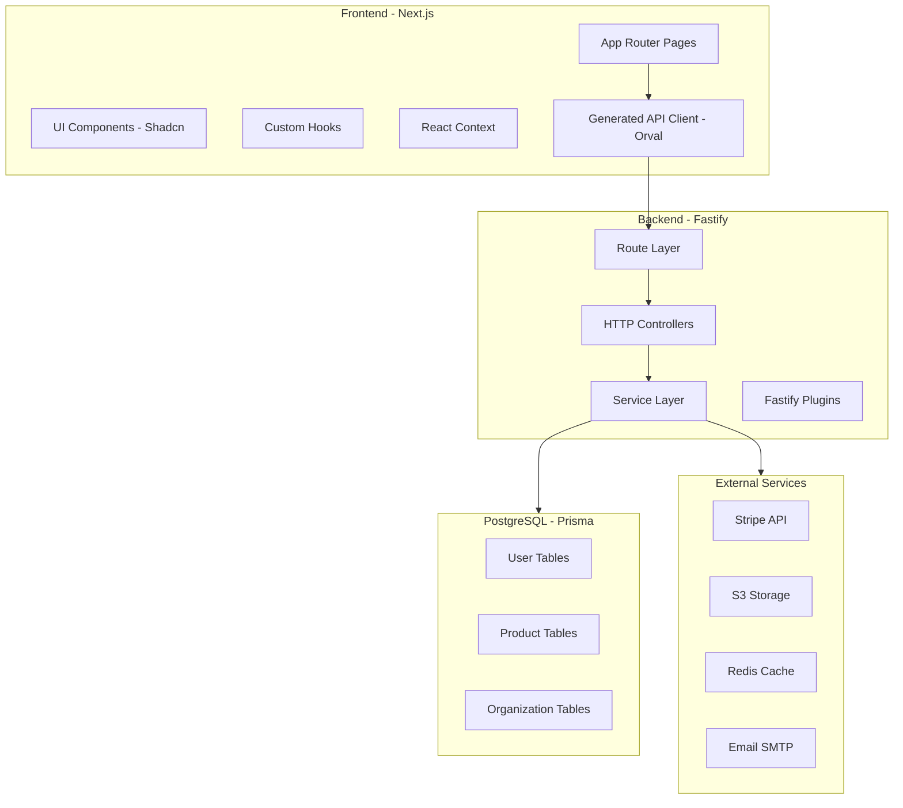
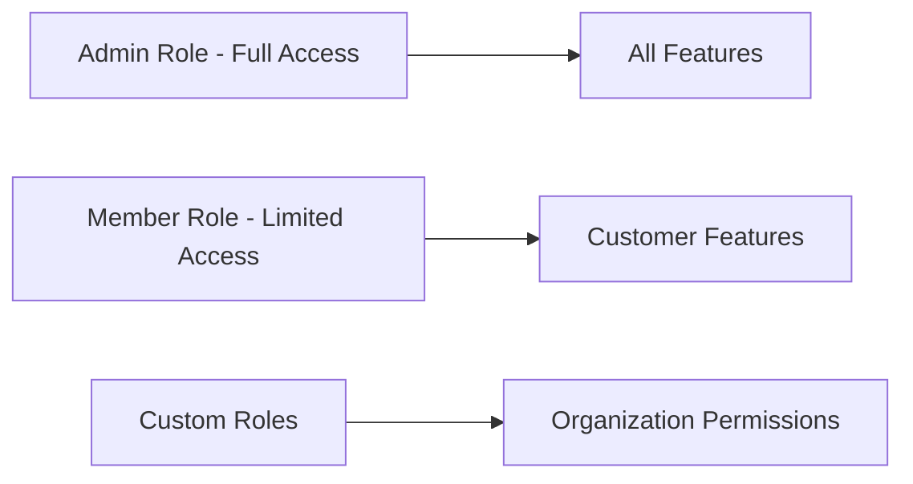
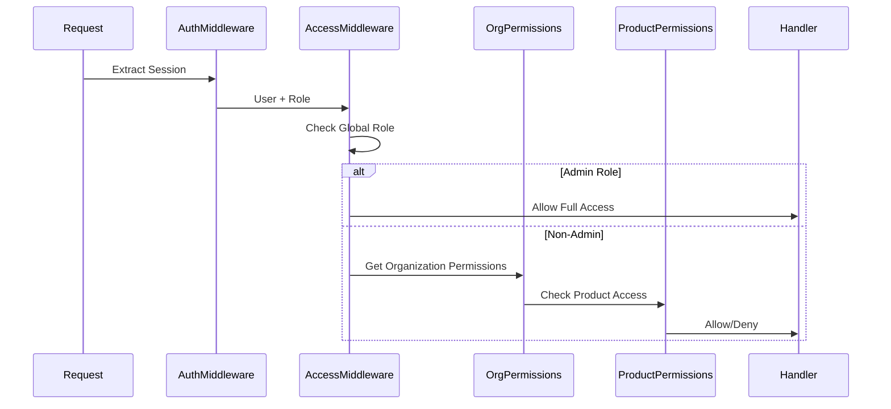
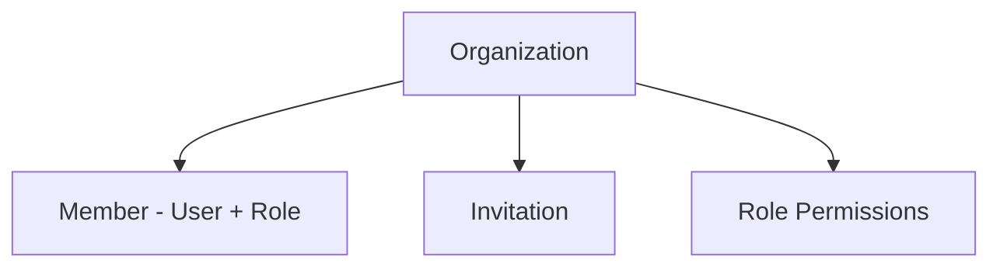
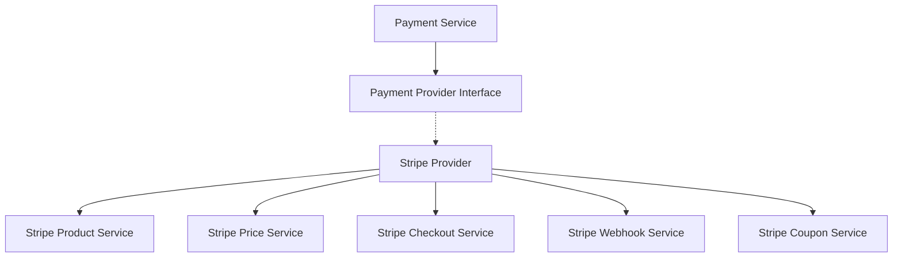
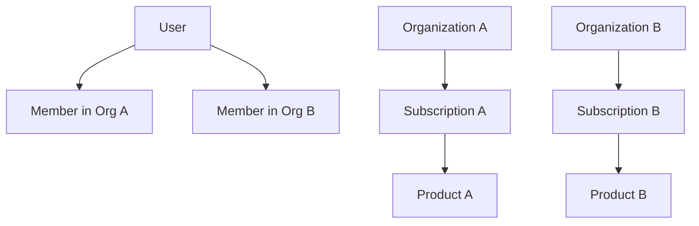

# SaaS Boilerplate - Deep Analysis

## Executive Summary

This is a comprehensive SaaS boilerplate built with modern technologies and patterns. It provides a solid foundation for building multi-tenant SaaS applications with user management, role-based access control (RBAC), module-based access control, and Stripe payment integration.

---

## Architecture Overview



---

## Feature Analysis

### 1. User Management

**Implementation Status: ✅ Fully Implemented**

The user management system is built on top of **Better Auth** with comprehensive features:

#### Database Schema
- [`User`](backend/prisma/schema.prisma:23) model with extended fields:
  - Basic info: email, name, username, image
  - Role reference: `roleSlug` for RBAC
  - Stripe integration: `stripeCustomerId`
  - Security: `twoFactorEnabled`, `emailVerified`
  - Preferences: JSON-stored user preferences

#### Authentication Features
| Feature | Implementation | Location |
|---------|---------------|----------|
| Email/Password | Better Auth with auto-sign-in | [`backend/src/auth.ts:39`](backend/src/auth.ts:39) |
| JWT Tokens | JWT plugin enabled | [`backend/src/auth.ts:74`](backend/src/auth.ts:74) |
| Two-Factor Auth | TOTP-based 2FA | [`backend/src/auth.ts:75`](backend/src/auth.ts:75) |
| Username Support | Custom username validation | [`backend/src/auth.ts:78`](backend/src/auth.ts:78) |
| Multi-Session | Concurrent session support | [`backend/src/auth.ts:83`](backend/src/auth.ts:83) |
| Session Management | 30-day sessions with notifications | [`backend/src/auth.ts:43`](backend/src/auth.ts:43) |

#### Frontend Integration
- [`AuthContext`](frontend/src/context/AuthContext.tsx:1) provides global auth state
- Sign in, sign up, sign out operations
- Session refresh and WebSocket-based session revocation

---

### 2. Role-Based Access Control (RBAC)

**Implementation Status: ✅ Fully Implemented**

The RBAC system operates at multiple levels:

#### Global Role System


#### Role Model
- [`Role`](backend/prisma/schema.prisma:11) model with:
  - `slug`: Unique identifier
  - `name`: Display name
  - `privilege`: Numeric privilege level

#### Permission Structure
Defined in [`access.middleware.ts`](backend/src/middleware/access.middleware.ts:6):

```typescript
// Customer Features - Available to all authenticated users
customerFeatures: {
    member: ["create", "update", "delete", "view"]
}

// Platform Features - Admin only
platformFeatures: {
    billing: ["create", "update", "delete", "view"]
}
```

#### Access Control Flow


---

### 3. Module-Based Access Control

**Implementation Status: ✅ Fully Implemented**

Module-based access control extends RBAC with fine-grained permissions:

#### Organization-Level Permissions
- [`OrganizationRolePermissions`](backend/prisma/schema.prisma:300) model stores:
  - `organizationId`: Organization scope
  - `roleSlug`: Role reference
  - `permissions`: JSON field with permission map

#### Product-Based Feature Gating
Products can define their own permission boundaries:

```typescript
// Product model includes permissions field
Product {
    permissions: Json  // Defines what features this product unlocks
}
```

#### Permission Resolution
From [`hasPermission`](backend/src/middleware/access.middleware.ts:28):

1. **Global Check**: Verify feature/action exists in system
2. **Admin Bypass**: Admins have full access
3. **Customer Feature Check**: Verify feature is customer-accessible
4. **Organization Permissions**: Check org-specific role permissions
5. **Product Permissions**: Verify active subscription grants access

---

### 4. Access Control Management

**Implementation Status: ✅ Fully Implemented**

#### Organization Structure


#### Organization Model Features
- [`Organization`](backend/prisma/schema.prisma:283) with:
  - Basic info: name, slug, logo
  - Metadata: JSON field for custom data
  - Relations: members, invitations, subscriptions

#### Member Management
- [`Member`](backend/prisma/schema.prisma:313) model:
  - Organization membership
  - Role assignment within organization
  - Unique constraint per organization

#### Invitation System
- [`Invitation`](backend/prisma/schema.prisma:328) model:
  - Email-based invitations
  - Role pre-assignment
  - Expiration support
  - Status tracking

---

### 5. Payment Integration (Stripe)

**Implementation Status: ✅ Fully Implemented**

#### Architecture Pattern
The payment system uses a **Provider Pattern** for flexibility:



#### Payment Provider Interface
[`PaymentProvider`](backend/src/services/payment/payment-provider.interface.ts:45):

| Method | Purpose |
|--------|---------|
| `createCheckoutSession` | Initialize Stripe Checkout |
| `handleWebhook` | Process Stripe webhooks |
| `cancelSubscription` | Cancel active subscription |
| `createProduct` | Create product in Stripe |
| `updateProduct` | Update product in Stripe |
| `deleteProduct` | Archive product in Stripe |
| `createProductPrice` | Create pricing tier |
| `createCoupon` | Create discount coupon |

#### Database Models

| Model | Purpose |
|-------|---------|
| [`Product`](backend/prisma/schema.prisma:184) | Sellable items with features and permissions |
| [`ProductPrice`](backend/prisma/schema.prisma:202) | Pricing tiers with intervals |
| [`Coupon`](backend/prisma/schema.prisma:221) | Discount codes |
| [`Subscription`](backend/prisma/schema.prisma:264) | Active subscriptions |
| [`Transaction`](backend/prisma/schema.prisma:245) | Payment records |

#### Webhook Events Handled
From [`stripe-webhook.service.ts`](backend/src/services/payment/stripe/stripe-webhook.service.ts:20):

| Event | Handler |
|-------|---------|
| `checkout.session.completed` | Create subscription record |
| `invoice.payment_succeeded` | Record transaction, update subscription |
| `customer.subscription.deleted` | Mark subscription canceled |
| `customer.subscription.updated` | Update subscription status |

---

### 6. Multi-Tenancy Support

**Implementation Status: ✅ Fully Implemented**

The boilerplate supports organization-based multi-tenancy:



#### Key Features
- Users can belong to multiple organizations
- Each organization has independent subscriptions
- Role-based permissions per organization
- Organization-specific product access

---

## Technology Stack

### Backend
| Technology | Purpose | Version/Config |
|------------|---------|----------------|
| Fastify | Web framework | High performance |
| Prisma | ORM | PostgreSQL |
| Better Auth | Authentication | With plugins |
| Stripe | Payments | Full integration |
| Socket.IO | Real-time | WebSocket support |
| Redis | Caching | ioredis |
| S3 | File storage | AWS SDK |

### Frontend
| Technology | Purpose | Version/Config |
|------------|---------|----------------|
| Next.js | Framework | App Router |
| TypeScript | Language | Strict mode |
| React Hook Form | Forms | With Zod |
| Shadcn/UI | Components | Radix + Tailwind |
| Orval | API Client | Generated from OpenAPI |
| TanStack Query | Data fetching | React Query |

---

## Project Structure

### Backend Structure
```
backend/src/
├── auth.ts              # Better Auth configuration
├── config.ts            # Environment configuration
├── server.ts            # Fastify server setup
├── auth/                # Auth documentation
├── config/              # Config documentation
├── enums/               # TypeScript enums
├── handlers/            # Error/response handlers
├── http/                # Controllers by access level
│   ├── admin/           # Admin-only endpoints
│   ├── auth/            # Authentication endpoints
│   ├── member/          # Authenticated user endpoints
│   └── webhook/         # Webhook handlers
├── locales/             # i18n translations
├── middleware/          # Request middleware
├── plugins/             # Fastify plugins
├── routes/              # Route organization
├── schemas/             # TypeBox schemas
├── services/            # Business logic layer
└── utils/               # Utility functions
```

### Frontend Structure
```
frontend/src/
├── app/                 # Next.js App Router
│   ├── auth/            # Authentication pages
│   ├── checkout/        # Payment checkout
│   └── dashboard/       # Protected dashboard
├── components/          # React components
│   └── ui/              # Shadcn UI components
├── context/             # React Context providers
├── enums/               # TypeScript enums
├── hooks/               # Custom React hooks
├── lib/                 # Utilities and config
├── locales/             # i18n translations
├── providers/           # React Query provider
└── utils/               # Client/server utilities
```

---

## API Organization

### Route Prefixes
| Prefix | Access Level | Purpose |
|--------|--------------|---------|
| `/api/v1/auth` | Public | Authentication |
| `/api/v1/member` | Authenticated | User operations |
| `/api/v1/admin` | Admin only | Administration |
| `/api/v1/webhooks` | Public | External webhooks |

### Admin Endpoints
| Route | Controller | Purpose |
|-------|------------|---------|
| `/admin/users` | user.controller.ts | User management |
| `/admin/products` | product.controller.ts | Product CRUD |
| `/admin/product-prices` | product-price.controller.ts | Pricing management |
| `/admin/coupons` | coupon.controller.ts | Coupon management |

### Member Endpoints
| Route | Controller | Purpose |
|-------|------------|---------|
| `/member/payment` | payment.controller.ts | Checkout, subscriptions |
| `/member/notifications` | notification.controller.ts | User notifications |
| `/member/session` | session.controller.ts | Session management |
| `/member/user` | user.controller.ts | Profile management |

---

## Security Features

### Authentication Security
- ✅ Password hashing (Better Auth)
- ✅ Two-factor authentication (TOTP)
- ✅ Session management with expiration
- ✅ JWT token support
- ✅ Multi-session detection

### Authorization Security
- ✅ Role-based access control
- ✅ Organization-level permissions
- ✅ Product-based feature gating
- ✅ Middleware-enforced protection

### API Security
- ✅ CORS configuration
- ✅ Input validation (TypeBox)
- ✅ Webhook signature verification
- ✅ Trusted origin validation

---

## Extensibility Points

### Adding New Payment Provider
1. Implement [`PaymentProvider`](backend/src/services/payment/payment-provider.interface.ts:45) interface
2. Register in [`providers.ts`](backend/src/services/payment/providers.ts)
3. Add configuration in [`config.ts`](backend/src/config.ts)

### Adding New Features/Modules
1. Define feature in [`access.middleware.ts`](backend/src/middleware/access.middleware.ts)
2. Add to `customerFeatures` or `platformFeatures`
3. Create product with matching permissions

### Adding New API Endpoints
1. Create schema in `schemas/` or controller file
2. Create controller in appropriate `http/` subfolder
3. Register in route file (`admin-routes.ts` or `member-routes.ts`)
4. Run `pnpm orval` to generate frontend client

---

## Current Limitations & Recommendations

### Limitations
1. **No audit logging** - No tracking of user actions
2. **No rate limiting** - API endpoints not rate-limited
3. **No email verification enforcement** - Optional verification only
4. **Limited organization roles** - Only owner/member defined

### Recommendations for Enhancement

#### High Priority
- [ ] Add audit logging for compliance
- [ ] Implement rate limiting middleware
- [ ] Add email verification requirement option
- [ ] Create organization role management UI

#### Medium Priority
- [ ] Add team/department hierarchy
- [ ] Implement feature flags system
- [ ] Add usage-based billing support
- [ ] Create admin dashboard analytics

#### Low Priority
- [ ] Add SSO providers (Google, GitHub, etc.)
- [ ] Implement API key management
- [ ] Add webhook management UI
- [ ] Create billing history UI

---

## Conclusion

This SaaS boilerplate is a well-architected, production-ready foundation with:

- **Comprehensive authentication** with Better Auth
- **Flexible access control** combining RBAC and module-based permissions
- **Full Stripe integration** with webhook handling
- **Multi-tenancy support** through organizations
- **Clean architecture** with separation of concerns
- **Type safety** across the stack with TypeScript
- **Generated API clients** for frontend-backend consistency

The codebase follows best practices with clear documentation, consistent patterns, and extensible design. It provides an excellent starting point for building SaaS applications that require user management, subscription billing, and fine-grained access control.
